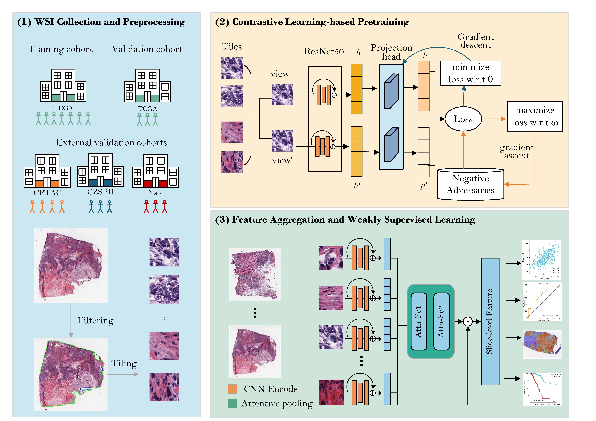

# Weakly supervised contrastive learning infers molecular subtypes and recurrence risk of breast cancer from pathology images 

Firstly, [adversarial contrastive learning](https://arxiv.org/abs/2011.08435) is used to train a encoder to extract tile-level features, and
then the attentive pooling is used to aggregate tile features to build the slide features. The slide feature is used in various downstream tasks, including tumor diagnosis, gene expression level prediction, molecular subtyping, recurrence risk prediction, and drug response prediction.


## Segmentation and tiling
You can download your own wsi dataset to the directory slides, 
then run data_processing/create_patches_fp.py to seg and tile wsis, 
adjust the parameters according to your needs.  
For example, you can use following command for segment and tile.  
``` shell
python create_patches_fp.py --source ../slides/TCGA-BRCA  --patch_size 256 --save_dir ../tile_results --patch --seg --tcga_flag
```  
When you run this command, it will run in default parameter, if you want to run with your parameter, you can modify tcga_lung.csv in directory preset, and add ```--preset ../preset/tcga_brca.csv```.
Then the coordinate files will be saved to ```tile_results/patches``` and the mask files that show contours of slides will be saved to ```tile_results/masks```.
Based on the previous step, you can randomly sample blocks for comparison learning training.
``` shell
python save_tiles.py --patch_size 256 --sample_number 100 --save_dir ../tiles_result
```  

## Training contrastive learning model
Run train_adco.py to train contrast learning model on tiles,
you should write Adco/ops/argparser.py to configure the data source
and the save address and ADCO related parameters firstly.
In addition, you need to prepare a CSV file similar to dataset_csv/sample_data.csv,
this file needs to save the name of the WSI file used for training.  
For example, you can use following command for training ADCO model with default parameter.  
``` shell
python3 train_adco.py --dist_url=tcp://localhost:10001 --data ../tiles_result/tiles_40x --save_path ../MODELS_SAVE --model_path ../MODELS_SAVE
```  

## Extracting tile-level features
Run data_processing/extract_features_fp.py to extract the tile-level features.
For example, you can use following command for extracting features.  
``` shell
python extract_features_fp.py --data_h5_dir ../tile_results --data_slide_dir ../slides/TCGA-BRCA --csv_path ../dataset_csv/sample_data.csv --feat_dir ../FEATURES --data_type tcga_brca --model_path ../MODELS_SAVE/adco_tcga.pth.tar
```  
The above command will use the trained ADCO model in ```model_path``` to extract tile features in ```data_slide_dir```
and save the features to ```feat_dir```. 

## Training classification model
Run train/train_tumor.py to perform downstream classification task. For example:  
``` shell
python train_tumor.py --lr 0.0003 --epochs 30 --K 3 --model_type clam_sb --feature_path ../FEATURES --label tumor --save_path ../RESULTS
```  
The above command will use the feature file in ```data_root_dir``` to train the classification model, and then output the test results to ```results_dir```.
User needs to divide the data set into training set, verification set and test set in advance and put them under dataset_csv/tumor, such as:  
``` bash
dataset_csv/tumor
	     ├── train_dataset_1.csv
	     ├── ...
	     ├── train_dataset_3.csv
	     ├── test_dataset_1.csv
	     ├── ...
	     ├── test_dataset_3.csv
	     ├── val_dataset_1.csv
	     ├── ...
	     ├── val_dataset_3.csv
```
## Training gene expression level
Run train/train_gene.py to perform downstream regression task. For example:  
``` shell
python train_gene.py --lr 0.0003 --epochs 30 --K 3 --model_type clam_mb --feature_path ../FEATURES --label all --save_path ../RESULTS
```  
The above command will train regression that using attention-pooling to aggregate tile features by default. User should prepare gene dataset like this:  
``` bash
dataset_csv/gene
	     ├── train_dataset_1.csv
	     ├── ...
	     ├── train_dataset_3.csv
	     ├── test_dataset_1.csv
	     ├── ...
	     ├── test_dataset_3.csv
	     ├── val_dataset_1.csv
	     ├── ...
	     ├── val_dataset_3.csv
```  
The training files is like dataset_csv/gene/sample_gene_data.csv.


